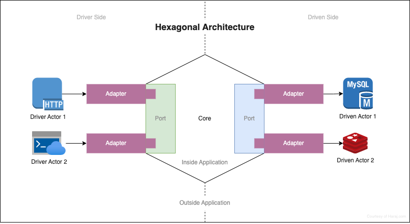

# Hexagonal Architecture

## Why Hexagonal Architecture?

In Solutions Team we always try work with small services. Even in the relatively complex system such as `Haraj Bill` or `Chat Next`, we always break them down to much smaller services depending on the focus of their business usecase.

The reason why we are doing this is because it is much easier for us to maintain smaller services rather than the big ones. So when the service require bug fix or need new feature, it is much easier to understand the code & do the changes to it because the code itself is relatively small.

However since we have a lot of small services, we need some kind of standard on how to develop these services. This is so every Solutions Team members can easily maintaining them.

On top of code maintainability, we also need to automate testing of our code. This is to ensure our changes is working as expected and it doesn't break another functionalities in the service.

After studying several architectural patterns, we found out that `Hexagonal Architecture` is the most suitable for our workflow.

Unlike its sibling `Clean Architecture` & `Onion Architecture` which focus on layers, `Hexagonal Architecture` focus on application business logic. This make it very easy to implement, especially in our workflow.

In the upcoming sections we will be discussing in-depth details about `Hexagonal Architecture`.

## What is Hexagonal Architecture?

Hexagonal architecture is architectural pattern that put the business logic as centre of everything in application codebase.

There are 3 main principles we need to follow when we want to implement this architecture:

1. Clearly divide between `"inside"` & `"outside"` of the application. `"Inside"` of the application is every components constructing application business logic where `"outside"` is the otherwise.
2. Dependencies on `"inside"` & `"outside"` boundaries should always point towards `"inside"` components, not the other way around.
3. Isolate boundaries between `"inside"` & `"outside"` components using ports & adapters.

From these principles we can infer 4 constructing parts of Hexagonal Architecture:

- [Core](#core) => Our business logic & its dependencies
- [Actors](#actors) => Any external entities interacting with our application core
- [Ports](#ports) => Interface that define how actors should interact with application core 
- [Adapters](#adapters) => Transforming request from actors to the core & vice versa. Implement ports.

Understanding these entities is crucial for understanding the implementation of Hexagonal Architecture. Each of them will be explained thoroughly in the upcoming sections. To make the explanation easier to be understood, we will use Hex PokeBattle project as example.

## Core

Core is the place where we put application business logic & its dependencies (including ports).

Sometimes it is not easy to determine what code should goes to the core. In such situation try to analyze the business requirements of our application. Try to understand the context of what our application should be done in order to fulfil the requirements. The "what our application should be done" is basically our business logic.

In the case of Hex PokeBattle, everything under `/internal/core` is the core of our application. In there we divide the business logic into two packages: `play` & `battle`. The reason why we divide it like that is because there are two usage context in our app:

- `Play context` => This is where the player starting new game and progressing the game itself
- `Battle context` => This is where the player battle enemy with his/her pokemon partner

As for `entity` package it contains the entities that being shared across the logic context such as `Pokemon` & `Game`.

[Back to Top](#hexagonal-architecture)

## Actors

Actors are external entities that interact with our application.

There are 2 types of actors:

- `Driver Actor` => Actor that initiating interaction with our application
- `Driven Actor` => Actor that being called by our application as the result of interaction with driver

In the case of Hex PokeBattle, REST API is the driver of our application & in-memory storages (for storing game, battle, & pokemon) are the driven ones.

[Back to Top](#hexagonal-architecture)

## Ports

Ports are interfaces defined inside core that define how actors should interact with the core & vice versa.

There are 2 types of ports:

- `Driver Port` => Ports for defining interaction between driver actor & core.
- `Driven Port` => Ports for defining interaction between core & driven actors.

In the case of Hex PokeBattle, the examples for `Driver Ports` are:

- `battle.Service`
- `play.Service`

As for the examples for `Driven Ports` are:

- `battle.BattleStorage`
- `battle.GameStorage`
- `battle.PokemonStorage`

[Back to Top](#hexagonal-architecture)

## Adapters

Adapters are components used to transform request from actors to application core & vice. They implements ports defined in the core.

There are 2 types of adapters:

- `Driver Adapter` => Adapter for transforming a specific technology request from driver actor into a call acceptable by application core.
- `Driven Adapter` => Adapter for transforming a technology agnostic request from the core into an a specific technology request on the driven actor.

In the case of Hex PokeBattle, the example for `Driver Adapters` is `rest.API`.

As for the examples for `Driven Adapters` are:

- `battlestrg.Storage`
- `gamestrg.Storage`
- `pokestrg.Storage`

[Back to Top](#hexagonal-architecture)

## DDD Relation

Domain-Driven Design (DDD) & Hexagonal Architecture is commonly paired together. Some people even used the terms interchangeably.

In reality, DDD & Hexagonal Architecture are two separate things. DDD is an approach to spot out application components from business model perspective, while Hexagonal Architecture give our application a structure. 

DDD basically provides a way to define application core for Hexagonal Architecture. But it is not a must for us to use DDD when implementing Hexagonal Architecture.

[Back to Top](#hexagonal-architecture)

## References

- https://alistair.cockburn.us/hexagonal-architecture/
- https://blog.octo.com/en/hexagonal-architecture-three-principles-and-an-implementation-example/
- https://www.youtube.com/watch?v=oL6JBUk6tj0
- https://medium.com/@matiasvarela/hexagonal-architecture-in-go-cfd4e436faa3
- https://medium.com/ssense-tech/hexagonal-architecture-there-are-always-two-sides-to-every-story-bc0780ed7d9c
- https://medium.com/ssense-tech/domain-driven-design-everything-you-always-wanted-to-know-about-it-but-were-afraid-to-ask-a85e7b74497a

[Back to Top](#hexagonal-architecture)